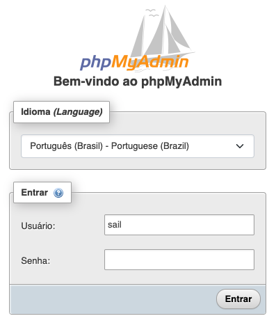
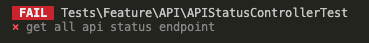
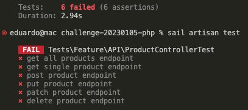
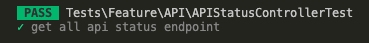
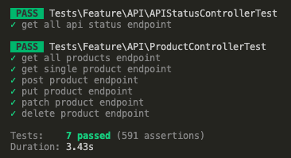
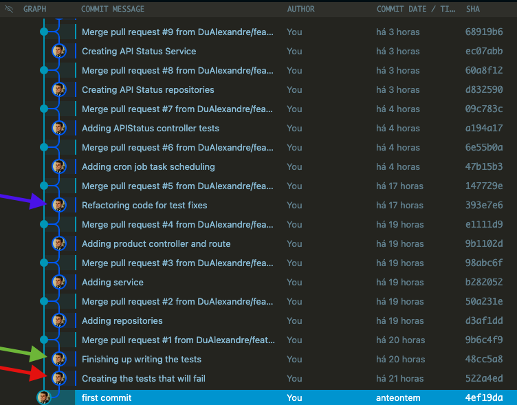
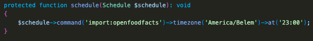
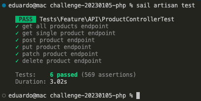
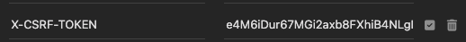

<a id='ancora'></a>
# Backend Challenge 20230105

This is a challenge by Coodesh
<br>
[Link da Apresentação](https://www.loom.com/embed/6733cf3543164ba7b059e527db507b05)

<br><br>

- [Sobre a Coodesh](#ancora1) <br>
- [Sobre o Desafio](#ancora2) <br>
- [Sobre o Projeto](#ancora3) <br>
- [Competências Desenvolvidas](#ancora4) <br>
- [Execução](#ancora5) <br>
- [Desenvolvedor](#ancora6)

<br><br>

<a id="ancora1"></a>

## Sobre a Coodesh

<br>

<p align="center">
  
</p>

<br>

A Coodesh nasceu com o propósito de ajudar outras empresas a construir os melhores e mais diversos times de tecnologia. Acreditamos que no contexto atual das startups e transformação digital de grandes empresas, recrutamento tech eficiente e com insights relevantes para evolução das pessoas contratadas é um dos maiores diferenciais para o sucesso.

<br>

<a id="ancora2"></a>

## Sobre o Desafio

<br>

Nesse desafio trabalharemos no desenvolvimento de uma REST API para utilizar os dados do projeto Open Food Facts, que é um banco de dados aberto com informação nutricional de diversos produtos alimentícios.
O projeto tem como objetivo dar suporte a equipe de nutricionistas da empresa Fitness Foods LC para que eles possam revisar de maneira rápida a informação nutricional dos alimentos que os usuários publicam pela aplicação móvel.
<br>

Nesta formação você terá uma visão geral do que é necessário para se tornar um desenvolvedor mobile no Sistema Operacional (SO) da Apple. Além disso, conteúdos mais avançados também estão disponíveis para que você conheça algumas boas práticas e padrões arquiteturais.

<br>

<a id="ancora3"></a>
## Sobre o Projeto

<br>

Para este projeto foi utilizada a linguagem de Programação PHP em conjunto com o Framework Laravel.  

<p align="center"><a href="https://laravel.com" target="_blank"></a></p>

<p align="center">
<a href="https://github.com/laravel/framework/actions"></a>
<a href="https://packagist.org/packages/laravel/framework"></a>
<a href="https://packagist.org/packages/laravel/framework"></a>
<a href="https://packagist.org/packages/laravel/framework"></a>
</p>

<br>

## Requisitos Obrigatórios

<br>

### Requisito 1
Criar um banco de dados MongoDB usando Atlas: https://www.mongodb.com/cloud/atlas ou algum Banco de Dados SQL se não sentir confortável com NoSQL;
* Entrega: Por familiaridade o banco de dados escolhido para o projeto foi o MySQL. Já está incluso no arquivo `docker-compose.yml` toda a configuração necessária para criação do banco e interface com o PHPmyAdmin.

<p align="center">
  
</p>

<br>

### Requisito 2
Criar uma REST API com as melhores práticas de desenvolvimento, Design Patterns, SOLID e DDD;
* Entrega: O Framework Laravel possui uma arquitetura voltada ao MVC (Model, View, Controller), entretanto é possível com algumas alterações protegermos melhor as dependências, domínios e regras de negócio do projeto. Para a construção de um modelo arquitetural DDD foram implementadas duas camadas a mais na aplicação: Uma de Repositories e outra de Services.

#### Repositories
* A camada de Repositories ficou responsável pela relação Modelo/Entidade da aplicação e pelo controle da integração com o Banco de Dados através do `Eloquent`. Com isso conseguimos utilizar dois dos princípios SOLID: o `Single Responsability Principle` pois cada classe do repositorio tem apenas a finalidade de interagir com sua respectiva entidade, e o `Open-Closed Principle` já que fica possível integrar a interface de repositório novas formas de consulta com o `Eloquent`.

#### Services
* A camada de Services está interligada à camada Repositories pois a mesma utiliza suas interfaces para construção das regras de negócio obedecendo o Design Pattern `Dependency Injection`. Além disso, fica responsável por comandar o Controller para integração dos Endpoints da API.

#### TDD
* Também foi incorporado ao projeto o método de desenvolvimento TDD (Test Driven Development) onde todo processo de desenvolvimento obedece o chamado ciclo `red-green-refactor`.

<p align="center">
  
</p>

- RED: Primeiro teste a ser escrito, que quando for executado irá falhar.
<p align="center">
  
</p>

<p align="center">
  
</p>

- GREEN: Após isso, foi implementado um código sucinto o suficiente para que faça com que os testes sejam aprovados.
<p align="center">
  
</p>

<p align="center">
  
</p>

- REFACTOR: Momento em que o código foi de fato escrito, orientando-se por manter os testes aprovados.

<br>
Na árvore de Commits é possível observar que em todos os momentos de criação de uma nova entidade a branch feature/tdd-test antecede qualquer outra branch.

<p align="center">
  
</p>


### Requisito 3
Integrar a API com o banco de dados criado para persistir os dados

* Entrega: O banco de dados MySQL já está configurando do `docker-composer.yml`. Na raiz do projeto, para criação da imagem do banco execute o comando:

`````
./vendor/bin/sail up -d
`````

Para criação das tabelas do banco execute o comando:

`````
sail artisan migrate
`````

Como mencionado anteriormente, está configurada também a interface do PHPmyAdmin no Docker, basta acessar em seu navegador:
`````
http://localhost:8001/
`````
Para acesso, utilize:
`````
Usuário: sail
Senha: password
`````

<br>

### Requisito 4
Para prosseguir com o desafio, precisaremos criar na API um sistema de atualização que vai importar os dados para a Base de Dados com a versão mais recente do Open Food Facts uma vez ao día. Adicionar aos arquivos de configuração o melhor horário para executar a importação.

*Entrega: Com o auxílio do `CRON Task Scheduling` do Laravel foi montado o sistema de agendamento de execuções. A configuração selecionada atualmente executa o download dos arquivos da Open Food Facts API às 23:00 da Timezone (America/Belem). Para efeito de testes o horário e timezone poderão ser alterados no arquivo `app/Console/Kernel.php`. Conforme imagem abaixo:

<p align="center">
  
</p>

Obs: Para consulta de lista de Timezones segue documentação php: [Documentação Timezones](https://www.php.net/manual/en/timezones.america.php)

Após finalizar a configuração execute o comando para iniciar o Cron:

`````
sail artisan schedule:work 
`````

<br>

### Requisito 5
Na REST API teremos um CRUD com os seguintes endpoints:
* GET /: Detalhes da API, se conexão leitura e escritura com a base de dados está OK, horário da última vez que o CRON foi executado, tempo online e uso de memória.

* PUT /products/:code: Será responsável por receber atualizações do Projeto Web

* DELETE /products/:code: Mudar o status do produto para trash


* GET /products/:code: Obter a informação somente de um produto da base de dados

* GET /products: Listar todos os produtos da base de dados, adicionar sistema de paginação para não sobrecarregar o REQUEST.

<br>

* Entrega: para visualização dos endpoints, consultar documentação da API desenvolvida:

[Documentação API - Fitness Foods LC](https://doc-api-fitness-foods.vercel.app/)

[Repositório da Documentação](https://github.com/DuAlexandre/doc-api-fitness-foods)

<br>

### Requisito 6 (Extra)
Configuração de um endpoint de busca com Elastic Search ou similares;

* Entrega: Por fazer.

<br>

### Requisito 7 (Extra)
Configurar Docker no Projeto para facilitar o Deploy da equipe de DevOps;

* Entrega: Docker devidamente integrado ao projeto. Para sua execução, efetuar os comandos:

`````
./vendor/bin/sail up -d
`````

(Opcional) Para facilitar o desenvolvimento, pode ser criado um alias para o comando sail:
`````
alias sail="bash ./vendor/bin/sail"
`````

<br>

### Requisito 8 (Extra)
Configurar um sistema de alerta se tem algum falho durante o Sync dos produtos;

* Entrega: Registro de falha de importação vinculado ao registro de logs do Laravel. É possível consultar qualquer falha em `storage/logs/laravel.log`. É possível também consultar o status armazenado no momento da importação na tabela APIStatus do banco de dados.

<br>

### Requisito 9 (Extra)
Descrever a documentação da API utilizando o conceito de Open API 3.0;

* Entrega: Documentação desenvolvida:

[Documentação API - Fitness Foods LC](https://doc-api-fitness-foods.vercel.app/)

[Repositório da Documentação](https://github.com/DuAlexandre/doc-api-fitness-foods)

<br>

### Requisito 10 (Extra)
Escrever Unit Tests para os endpoints  GET e PUT do CRUD;

* Entrega: Testes feitos em TODAS os endpoints da API:

<p align="center">
  
</p>

Para execução dos testes utilize o comando:
``````
sail artisan test
``````

<br>

### Requisito 11 (Extra)
Escrever um esquema de segurança utilizando API KEY nos endpoints.

* Entrega: Os endpoints de `POST`, `PUT`, `PATCH` e `DELETE` possuem proteção de API Keys via `X-CSRF-TOKEN`. Acesse a rota `/token` para geração do mesmo, em seguida em seu API-Client de preferência introduza na aba `Headers` o par chave/valor do respectivo token, como no exemplo abaixo:

<p align="center">
  
</p>
<br>

<a id="ancora4"></a>
## Competências Desenvolvidas

<br>

* PHP;
* Laravel;
* Composer;
* Eloquent;
* Docker;
* PHPUnit;
* MySQL;
* RestAPI;
* Clean Code;
* SOLID;
* DDD;
* TDD;

<br>

<br>

<a id="ancora5"></a>
## Execução 

<br>

1. Clone este repositório remoto em seu equipamento:
```
git clone git@github.com:DuAlexandre/backend-challenge-20230105-php.git
```

2. Acesse a pasta do projeto:
````
cd backend-challenge-20230105-php
````

3. Abra o VSCode ou IDE de sua preferência:
````
code .
````

4. Renomeie o arquivo `.env.example` para `.env` e introduza suas variáveis de ambiente;

5. Instale as dependências do composer:
````
composer install
````

6. Inicialize os Containers do Docker:
````
./vendor/bin/sail up -d
````

7. Crie um alias para uso do docker:
`````
alias sail="bash ./vendor/bin/sail"
`````

8. Crie uma chave de API com o Docker para o arquivo `.env`
````
sail artisan key:generate
````

9. Utilize todos os comandos mencionados anteriormente do docker :).


<br>

<a id="ancora6"></a>
## Desenvolvedor

Projeto desenvolvido por:

<table align="center">
  <tr>
    <td align="center">
      <a target="_blank" href="https://www.linkedin.com/in/eduardo-alexandre025/">
        <br>
        <sub>
          <b>Eduardo Alexandre</b>
           <p>Back-End PHP</p>
        </sub>
      </a>
    </td>
  </tr>
</table>

<br><br>

[Voltar ao Topo](#ancora)
